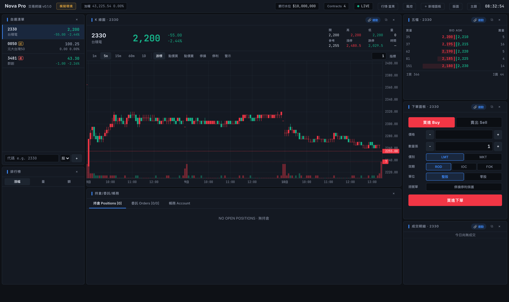
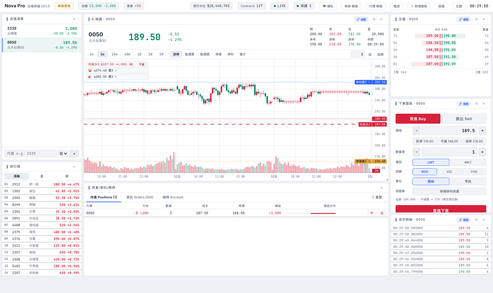

# Nova Pro — 專業交易終端 Trading Terminal

A professional, fully-customizable trading terminal for Taiwan markets
(TWSE / TPEX / TAIFEX). Forked from
[shioaji-pro-app](https://github.com/Sinotrade/shioaji-pro-app) and rewired to:

- **多券商交易** — 台新 [Nova API](https://ml-fugle-api.tssco.com.tw/FugleSDK/docs/trading/introduction/)（`taishin-sdk`）、
  富邦[新一代 API](https://www.fbs.com.tw/TradeAPI/docs/trading/introduction)（`fubon-neo`）、
  玉山富果（`@esun/trade`）— UI 熱切換，SDK 已隨 repo 提供（clone 即用）
- **行情** — [富果行情 API](https://developer.fugle.tw/docs/data/intro)（REST + WebSocket），
  或隨券商自帶行情自動切換
- **Topstep 式圖表部位管理** — 圖上拖曳停損/停利、一鍵保本、
  自動括號單，三層保護（券商端條件單／本機觸價引擎／到期防呆）

React 19 + TypeScript + Vite 前端維持不變，原本的 shioaji sidecar 改為
本 repo 內建的 **Node.js local server**（`server/`），對前端提供相同的
REST + SSE 介面（`127.0.0.1:8080`），對外橋接券商 SDK 與富果行情。

```
React 前端 ── HTTP REST + SSE ──► server/（Fastify）
                                    ├─ 券商:  mock │ 富邦 │ 台新 │ 玉山（UI 熱切換）
                                    ├─ 行情:  mock │ 富果 │ 券商自帶
                                    └─ 觸價引擎（停損/停利/OCO — 關閉分頁仍有效）
```

預設 **mock 模式**：不需要任何憑證即可完整體驗（確定性模擬行情 +
紙上交易撮合）；拿到 API key / 憑證後在 UI 表頭選單即可切換真實來源。

以專業交易終端為目標：即時行情、K 線、五檔、閃電下單、圖表點價下單、
停損停利觸價單、可拖拉的自訂版面。



| Dark | Light |
|------|-------|
|  |  |

## Features 功能

- **🆕 Topstep 式圖表部位管理** — 三層保護架構：
  - 圖上**拖曳停損/停利線**即時改價、持倉均價線＋即時損益、
    **一鍵保本（BE）**、一鍵平倉、點圖進場**自動帶停損停利括號**
    （股票 % / 期貨點數位移，以實際成交價為基準）
  - **觸價引擎在本機伺服器**（關閉瀏覽器分頁保護仍有效）：OCO 互斥、
    當日有效/GTC、跨券商切換自動暫停、重啟絕不誤觸發（離線期間穿價
    → 暫停待確認）、表頭「保護」燈號顯示引擎狀態
  - **富邦帳戶可升級為券商端條件單**（singleCondition + TPSL 子單，
    斷網斷電皆有效；欄位對應未經實戶驗證 `TODO(verify)`，失敗自動
    退回本機層並警告）
- **即時行情** — 單一 SSE 連線串流 tick / 五檔，自選清單成交閃動（只在真實成交時閃，試撮不閃）
- **K 線圖** — lightweight-charts，1m/5m/15m/60m/1D，即時 tick 更新當根 K 棒
  - **點價下單**：點圖表價位直接限價買賣
  - **停損 / 停利**：在圖上掛觸價單（觸價送市價單），虛線顯示、可取消
  - **委託管理**：未成交委託顯示為實線、overlay 有 CANCEL 按鈕、**拖曳委託線即改價**
  - **Hover 同步**：十字線價位即時同步到下單面板
- **閃電下單** — 價格梯點擊即下單（左欄買/右欄賣），含安全開關
- **五檔報價** — 量能條視覺化，點價帶入下單面板
- **成交明細** — 開啟即載入歷史 tick
- **下單面板** — 整股/零股、ROD/IOC/FOK、期貨倉別，兩段式確認防誤觸
- **持倉 / 委託 / 帳務** — 即時損益、刪單、權益數與保證金
- **排行榜** — 漲幅 / 量 / 額 scanner，點擊即加入追蹤
- **交易安全** — 風控 Kill Switch（單筆上限/日虧上限/一鍵鎖單）、
  Esc×2 全部刪單、括號單（成交後自動掛 OCO 停損停利）、持倉一鍵平倉/反手、
  委託改量、下單預估成本（手續費/稅/契約值）
- **快捷鍵** — B/S 切換買賣、Esc×2 全刪單、⌘K 商品搜尋跳轉
- **技術指標** — MA5/10/20/60、EMA、布林通道、VWAP 疊圖
- **大盤狀態列** — 加權指數與台指期基差常駐頂部
- **到價警示** — 圖上點擊設警示線（只通知不下單），音效＋toast
- **分析面板** — 損益分析（權益曲線/勝率/賺賠比）、分價量表＋內外盤比、
  個股籌碼卡（融資券/借券/處置股）、選擇權 T 字報價（TXO）
- **行情回放** — 重播當日歷史 tick 練盤感（1x–100x 變速）
- **委託簿熱圖** — 五檔掛單牆的時間序列視覺化
- **自訂版面** — react-grid-layout 拖拉移動/縮放，面板可任意新增（多開 K 線圖）、
  每個面板可「連動自選」或「鎖定商品」、可彈出成獨立視窗（多螢幕）、
  版面可命名儲存/載入
- **音效回報** — 成交/委託/警示分音色（可關閉）
- **斷線自愈** — SSE 重連後自動重新訂閱所有商品
- **主題** — 深色 / 純黑 / 淺色 × 紅漲綠跌(台式) / 綠漲紅跌(美式)
- **券商熱切換** — 表頭選單在 mock / 富邦 / 台新 / 玉山 間切換免重啟，
  券商模式行情自動改用該券商 SDK 自帶行情（免富果 Key），開機恢復上次選擇
- **多自選清單** — 清單下拉切換；`POST /api/v1/watchlist/import` 批次匯入
  外部清單（同名覆蓋，適合從會員系統同步）
- **證券帳務概覽** — 總未實現損益（報酬率）、今日總損益、今日已實現、
  今日未實現變化、總市值、交割餘額；期貨保證金卡片僅期貨帳戶顯示
- **隱私模式** — 一鍵模糊持倉數量/成本/損益等機敏數字（截圖、分享畫面用），
  行情價格不受影響
- **下單快速帶價** — 下單面板一鍵帶入漲停/平盤/跌停價（自動對齊合法 tick）
- **帳務事件驅動** — 帳務查詢以券商主動回報驅動快取失效，避開帳務 API
  流量控管；收盤後五檔/報價保留最後狀態（SSE snapshot 重放）

## 券商支援矩陣

| Provider | 證券下單 | 期貨/選擇權下單 | 登入方式 | 狀態 |
|---|---|---|---|---|
| `mock`（預設） | ✅ 模擬撮合 | ✅ 模擬撮合 + 保證金 | 不需要 | 可用 |
| `fubon` 富邦新一代 | ✅ | ✅ | 身分證字號＋密碼（或 API Key）＋憑證 .pfx | 已實作（依 fubon-neo 2.2.8 + 官方文件查證，含實單下單/刪單驗證） |
| `nova` 台新 Nova | ✅ | ❌（前端自動隱藏期權下單 UI） | 身分證字號＋密碼＋憑證 .p12 | 已實作（依 taishin-sdk 1.0.2 + 官方文件查證，含實單下單/刪單驗證） |
| `esun` 玉山 | ✅ | ❌（前端自動隱藏期權下單 UI） | 帳號＋密碼＋API Key/Secret＋憑證 .p12 | 已實作（依 @esun/trade 2.2.0 typings 查證；登入/查詢/行情已實測，下單待實單驗證） |

**券商熱切換**：表頭「券商」選單可在 mock / 富邦 / 台新 間直接切換，
免重啟 server。憑證來源（擇一）：環境變數（`FUBON_*` / `NOVA_*`，見
`.env.example`）、或在選單表單輸入一次（存到 gitignored
`server/data/config.json`，權限 600）。切換到券商後**行情自動改用該券商
SDK 自帶的行情**（富邦/台新行情 API，免富果 Key）；切回 mock 則恢復
「行情」選單的獨立設定（富果 Key 或模擬）。

行情：`mock`（預設）、`fugle`（富果 — 表頭「行情」選單貼 API Key）、或
券商自帶行情（隨「券商」選單自動跟隨）。注意：**台指期／選擇權行情需要
方案包含期權行情**，若 API 回 403 會自動降級（證券行情不受影響，期權
面板顯示無資料），server log 會有明確警告。

期權下單能力由 server 在 `GET /api/v1/info` 回傳的
`capabilities.futures_trading` 決定，前端據此顯示/隱藏期權下單介面 —
期權**行情**（選擇權 T 字報價、台指期基差）無論哪家券商都保留。
`capabilities.condition_orders`（目前僅富邦）則決定停損停利保護可否
升級為**券商端條件單**（斷網斷電皆有效；失敗自動退回本機觸價引擎）。

## Getting Started 開始使用

### 1. Prerequisites 前置需求

- [Node.js](https://nodejs.org/) 20.19+ / 22+（Vite 8 要求；repo 附 `.nvmrc`）與 [pnpm](https://pnpm.io/)
- （mock 模式不需要其他東西）

### 2. 安裝與啟動（mock 模式）

```sh
pnpm install
pnpm dev:all     # 同時啟動 vite 前端 + server（mock 行情與交易）
```

開啟 [http://localhost:5173](http://localhost:5173) —— dev server 會把
`/api` 代理到 `localhost:8080`。頂部會顯示「模擬環境」徽章。

也可以分開跑：`pnpm dev:server`（後端）+ `pnpm dev`（前端）。

### 3. 接真實券商 / 行情

券商 SDK（taishin-sdk / fubon-neo / @esun/trade）**已隨 repo 提供**，
`pnpm install` 就裝好了 — 不需要另外下載任何東西。

**最簡單的方式（推薦）— 全部在 UI 完成：**

1. **行情**：表頭「行情」選單 → 貼上[富果 API key](https://developer.fugle.tw/)
   →「連接富果行情」（注意各方案的 WS 訂閱數與 REST rate limit；期權行情
   需方案支援，403 自動降級）
2. **券商**：表頭「券商」選單 → 選富邦/台新/玉山 → 填一次憑證資料
   （存到 gitignored `server/data/config.json`，權限 600）→ 切換後
   行情自動跟隨該券商自帶的行情 SDK

**進階 — 環境變數**（適合無頭部署，見 `.env.example`）：
`FUBON_ID_NO/FUBON_PASSWORD/FUBON_CERT_PATH/...`、`NOVA_*`、`ESUN_*`，
搭配 `TRADE_PROVIDER=fubon|nova|esun`。

> ⚠️ 接上真實券商後，每一筆委託都是真實交易。富邦/台新的下單、刪改單
> 已經過實單驗證；玉山下單與**富邦券商端條件單（停損停利二合一）**尚未
> 實單測試（搜尋 `TODO(verify)`）— 首次使用請以最小單位（零股／一口
> 小台）驗證全流程。台新**一帳號限一個 API session**，若其他程式佔用
> 同帳號，帳務查詢會回空。

## Server API（與前端的契約）

`server/` 完整複刻原 shioaji sidecar 的介面：`/api/v1/health`、`/info`、
`/auth/accounts`、`/data/{contracts,snapshots,kbars,ticks,scanner,credit_enquire,short_stock_sources,regulatory_punish}`、
`/stream/{subscribe,unsubscribe,data(SSE)}`、
`/order/{place_order,cancel_order,update_price,update_qty,trades}`、
`/portfolio/{position_unit,account_balance,margin,profit_loss}`、`/watchlist`。

SSE events：`tick_stk` / `tick_fop` / `bidask_stk` / `bidask_fop` /
`order_event` / `heartbeat`。

## Desktop App 桌面版（從原始碼建置）

桌面版已接線：Tauri 殼會把 `server/`（用 bun 編成單檔 binary 的 sidecar）
自動啟動在 `127.0.0.1:8080`，結束時關閉。**clone → 一行指令 → 一個可用的
桌面 app（mock 模式，免任何憑證／富果帳號）。** 一行指令會自動偵測你的
平台、把 sidecar 編成 Tauri 需要的正確檔名，你**不用**碰任何 target triple。

> 這是從原始碼自建，不是預先簽章的安裝檔。macOS 自建的 `.app` 不會碰到
> Gatekeeper（見下方「啟動」）。簽章／公證刻意未做（這是個人開源專案）。

### 由淺到深的三條路（建議照順序）

```sh
pnpm install

pnpm dev:all         # ① 最快：瀏覽器看 → http://localhost:5173（不需 Rust/bun）
pnpm desktop:dev     # ② 真正的桌面視窗（開發模式，sidecar 自動啟動）
pnpm desktop:build   # ③ 產出可安裝的 .app/.dmg | .msi/.exe | .deb/.rpm
```

第 ① 條只需要 Node + pnpm（見上方 Getting Started）。第 ②③ 條要**多裝**
桌面建置工具鏈 —— 先跑體檢，它會告訴你缺什麼、怎麼補：

```sh
pnpm desktop:doctor  # 檢查 node / rust / bun / pnpm，缺的會印出對應安裝指令
```

### 桌面建置的額外前置（②③ 才需要）

| 工具 | 用途 | 安裝 |
|---|---|---|
| **Rust**（rustup） | 編 Tauri 殼 | <https://rustup.rs> |
| **bun** ≥ 1.1.5 | 把 server 編成 sidecar | `curl -fsSL https://bun.sh/install \| bash`（Win：`powershell -c "irm bun.sh/install.ps1 \| iex"`） |
| 系統函式庫 | 各 OS 視窗層 | macOS：`xcode-select --install`；Windows：Visual Studio「Desktop development with C++」＋ WebView2（Win11 與多數已更新的 Win10 已內建；若開啟後是空白視窗再裝 WebView2 Evergreen runtime）；Debian/Ubuntu：見下 |

```sh
# Debian/Ubuntu 系統依賴（完整清單，新機器需要）
sudo apt update && sudo apt install -y libwebkit2gtk-4.1-dev \
  build-essential curl wget file libxdo-dev libssl-dev \
  libayatana-appindicator3-dev librsvg2-dev
```

> 本 repo 是 **pnpm** 工作區，請用 pnpm（不要用 npm）。沒有 pnpm 就 `corepack enable`。

### 建置與啟動

`pnpm desktop:build` 完成後，安裝檔在 `src-tauri/target/release/bundle/`
（macOS：`dmg/`＋`macos/`；Windows：`msi/`、`nsis/`；Linux：`deb/`、`rpm/`）。
啟動後頂部會顯示**「模擬環境」**徽章，不需任何憑證即可操作。

> Linux 本機建置只產 `.deb` / `.rpm`（涵蓋 Debian/Ubuntu 與 Fedora/RHEL）；
> 不產 AppImage —— 其打包工具（linuxdeploy）在新版發行版上不穩。需要 AppImage
> 請走 CI release（`release.yml` 保留全格式）。

- **macOS**：自己 build 的 `.app` 直接開即可；若因故被 Gatekeeper 攔，
  右鍵 →「打開」一次即可（不需關閉 Gatekeeper）。
- **Windows**：未簽章的 `.msi`/`.exe` 首次執行會跳 SmartScreen「Windows
  已保護您的電腦」→ 點「其他資訊 → 仍要執行」。想完全避開可改用
  `pnpm desktop:dev`（不產生安裝檔、不碰 SmartScreen）。

### 建置失敗了？

先跑 `pnpm desktop:doctor`。仍卡住的話，把錯誤訊息對照
[`AGENTS.md`](AGENTS.md) 的疑難排解表（依錯誤訊息查對應解法）——
該檔也是給 AI 助手讀的，讓它能直接幫你把卡住的環境救回來。

## Safety notes 安全提醒與免責聲明

- 預設為**模擬環境**；頂部會顯示「模擬環境」徽章，正式環境為紅色「正式環境」
- 閃電下單預設**鎖定**，需手動啟用；圖表點價下單為 one-shot 模式
- 停損/停利為**客戶端觸價單**，只在頁面開啟時監控
- 正式環境的每一筆委託都是真實交易，請自行承擔風險

> **免責聲明**：本軟體為開源專案，依 MIT 授權「現狀（AS IS）」提供，
> 不附任何明示或默示之保證。本軟體非投資建議；串接真實券商後之所有
> 交易盈虧、因軟體缺陷／行情延遲／斷線等造成之任何損失，均由使用者
> 自行承擔。作者與貢獻者不對任何交易結果負責。憑證、密碼與 API Key
> 僅儲存於使用者本機，請妥善保管。

## Stack

- React 19 + TypeScript + Vite 8
- [vanilla-extract](https://vanilla-extract.style/) — zero-runtime themable CSS
- [lightweight-charts](https://tradingview.github.io/lightweight-charts/) v5
- [react-grid-layout](https://github.com/react-grid-layout/react-grid-layout) v2
- [Fastify](https://fastify.dev/) local server — REST + Server-Sent Events
- 台新 Nova API / 富邦新一代 API（交易）＋富果行情 API（行情）

## License

MIT — 見 [LICENSE](LICENSE)。本專案 fork 自
[Sinotrade/shioaji-pro-app](https://github.com/Sinotrade/shioaji-pro-app)（MIT），
保留原作者版權聲明；修改與新增部分版權屬本專案作者。
「Shioaji」「Nova」「富果」等名稱為各原公司之商標，僅作描述性使用。
